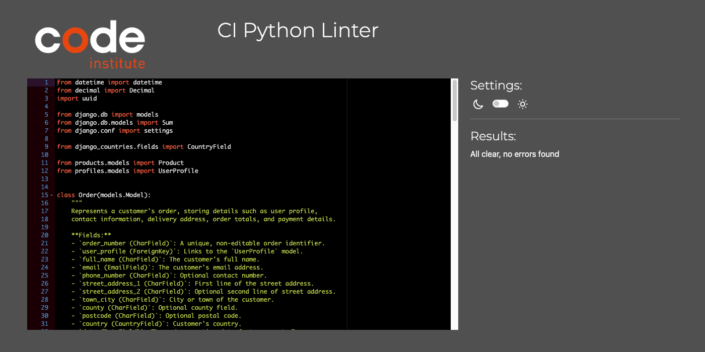
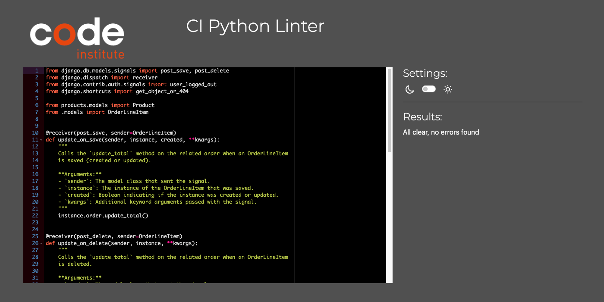
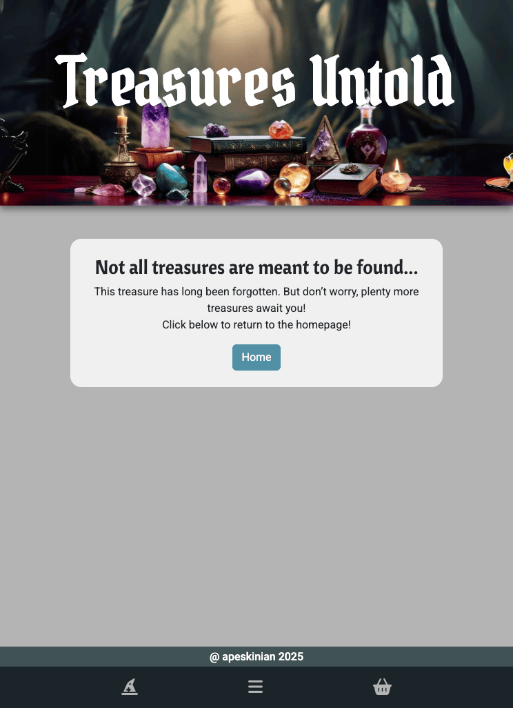
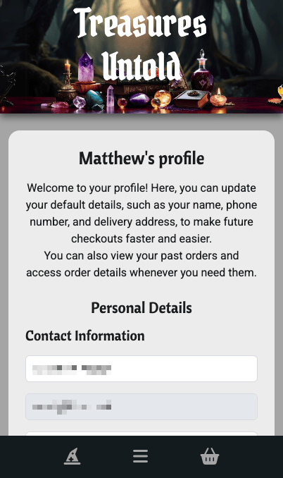
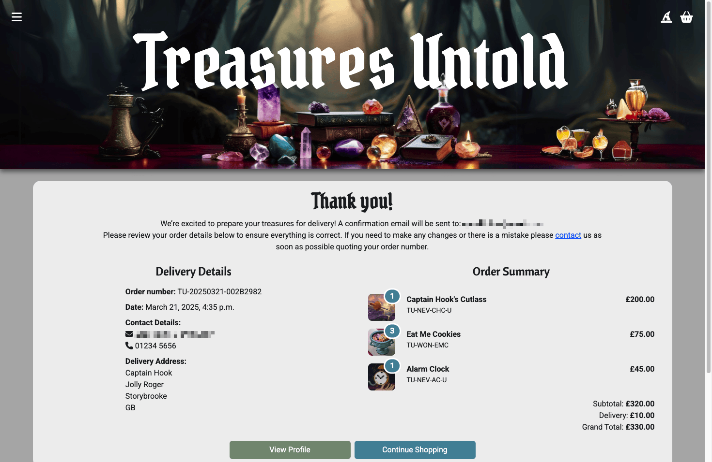

# Testing

> [!NOTE]
> Return back to the [README.md](README.md) file.

## Code Validation

### HTML

I have used the recommended [HTML W3C Validator](https://validator.w3.org) to validate all of my HTML files.

#### Page Templates

> [!NOTE]  
> The main template and also other partial html files listed below were tested as part of the main site files as they include them.
> - base.html
> - toast_error.html
> - toast_info.html
> - toast_rewards.html
> - toast_success.html
> - toast_warning.html
> - info_section.html
> - login_options.html
> - mobile_navbar.html
> - standard_navbar.html
> - sort_and_filter.html

| Directory | Template | Specific Includes File | URL | Screenshot | Notes |
| --- | --- | --- | --- | --- | --- |
| templates/account | [login.html](templates/account/login.html) | n/a | [W3 Validator](https://validator.w3.org/nu/?doc=https%3A%2F%2Fapeskinian-treasures-untold-568a3e176ede.herokuapp.com%2Faccounts%2Flogin%2F) |  | No errors or warnings found. |
| templates/account | [logout.html](templates/account/logout.html) | n/a | n/a |  | No errors or warnings found. |
| templates/account | [signup.html](templates/account/signup.html) | n/a | [W3 Validator](https://validator.w3.org/nu/?doc=https%3A%2F%2Fapeskinian-treasures-untold-568a3e176ede.herokuapp.com%2Faccounts%2Fsignup%2F) |  | No errors or warnings found. |
| templates | [404.html](templates/404.html) | n/a | n/a |  | No errors or warnings found. |
| templates | [500.html](templates/500.html) | n/a | n/a |  | No errors or warnings found. |
| home/templates/home | [index.html](home/templates/home/index.html) | n/a | [W3 Validator](https://validator.w3.org/nu/?doc=https%3A%2F%2Fapeskinian-treasures-untold-568a3e176ede.herokuapp.com%2F) |  | No errors or warnings found. |
| products/templates/products | [products.html](products/templates/products/products.html) | n/a | [W3 Validator](https://validator.w3.org/nu/?doc=https%3A%2F%2Fapeskinian-treasures-untold-568a3e176ede.herokuapp.com%2Fproducts%2F) |  | No errors or warnings found. |
| products/templates/products | [product_detail.html](products/templates/products/product_detail.html) | n/a | [W3 Validator](https://validator.w3.org/nu/?doc=https%3A%2F%2Fapeskinian-treasures-untold-568a3e176ede.herokuapp.com%2Fproducts%2F26%2F) |  | No errors or warnings found. Link goes to specific product but same template used for all products. |
| support/templates/support | [support.html](support/templates/support/support.html) | [faqs.html](support/templates/support/includes/faqs.html) | [W3 Validator](https://validator.w3.org/nu/?doc=https%3A%2F%2Fapeskinian-treasures-untold-568a3e176ede.herokuapp.com%2Fsupport%2Ffaq%2F) |  | No errors or warnings found. |
| support/templates/support | [support.html](support/templates/support/support.html) | [contact.html](support/templates/support/includes/contact.html) | [W3 Validator](https://validator.w3.org/nu/?doc=https%3A%2F%2Fapeskinian-treasures-untold-568a3e176ede.herokuapp.com%2Fsupport%2Fcontact%2F) |  | No errors or warnings found. |
| support/templates/support | [support.html](support/templates/support/support.html) | [thankyou.html](support/templates/support/includes/thankyou.html) | [W3 Validation](https://validator.w3.org/nu/?doc=https%3A%2F%2Fapeskinian-treasures-untold-568a3e176ede.herokuapp.com%2Fsupport%2Fthankyou%2F) |  | No errors or warnings found. |
| support/templates/support | [support.html](support/templates/support/support.html) | [newsletter.html](support/templates/support/includes/newsletter.html) | [W3 Validator](https://validator.w3.org/nu/?doc=https%3A%2F%2Fapeskinian-treasures-untold-568a3e176ede.herokuapp.com%2Fsupport%2Fnewsletter%2F) |  | No errors or warnings found. |
| support/templates/support | [support.html](support/templates/support/support.html) | [newsletter_success.html](support/templates/support/includes/newsletter_success.html) | n/a |  | No errors or warnings found. |
| support/templates/support | [support.html](support/templates/support/support.html) | [returns_policy.html](support/templates/support/includes/returns_policy.html) | [W3 Validator](https://validator.w3.org/nu/?doc=https%3A%2F%2Fapeskinian-treasures-untold-568a3e176ede.herokuapp.com%2Fsupport%2Freturns%2F) |  | No errors or warnings found. |
| support/templates/support | [support.html](support/templates/support/support.html) | [privacy_policy.html](support/templates/support/includes/privacy_policy.html) | [W3 Validator](https://validator.w3.org/nu/?doc=https%3A%2F%2Fapeskinian-treasures-untold-568a3e176ede.herokuapp.com%2Fsupport%2Fprivacy%2F) |  | No errors or warnings found. |
| support/templates/support | [support.html](support/templates/support/support.html) | [terms.html](support/templates/support/includes/terms.html) | [W3 Validator](https://validator.w3.org/nu/?doc=https%3A%2F%2Fapeskinian-treasures-untold-568a3e176ede.herokuapp.com%2Fsupport%2Fterms%2F) |  | No errors or warnings found. |
| staff/templates/staff | [dashboard.html](staff/templates/staff/dashboard.html) | [product_admin.html](staff/templates/staff/includes/product_admin.html) | n/a |  | No errors or warnings found. |
| staff/templates/staff | [dashboard.html](staff/templates/staff/dashboard.html) | [faq_admin.html](staff/templates/staff/includes/faq_admin.html) | n/a |  | No errors or warnings found. |
| staff/templates/staff | [dashboard.html](staff/templates/staff/dashboard.html) | [messages_admin.html](staff/templates/staff/includes/messages_admin.html) | n/a |  | No errors or warnings found. |
| staff/templates/staff | [dashboard.html](staff/templates/staff/dashboard.html) | [newsletter_admin.html](staff/templates/staff/includes/newsletter_admin.html) | n/a |  | No errors or warnings found. |
| profiles/templates/profiles | [profile.html](profiles/templates/profiles/profile.html) | n/a | n/a |  | No errors or warnings found. |
| basket/templates/basket | [basket.html](basket/templates/basket/basket.html) | n/a | n/a |  | No errors or warnings found. |
| checkout/templates/checkout | [checkout.html](checkout/templates/checkout/checkout.html) | n/a | n/a |  |  No errors or warnings found. |
| checkout/templates/checkout | [checkout_success.html](checkout/templates/checkout/checkout_success.html) | n/a | n/a |  | No errors or warnings found. |

#### Email Body Templates

HTML was checked by viewing the original message in the email client and then copying the raw html into the W3 validator.

| Directory | Template | Screenshot | Notes |
| --- | --- | --- | --- |
| support/templates/support_emails | [contact_acknowledgment_body.html](support/templates/support/support_emails/contact_acknowledgment_body.html) |  | No errors or warnings found. |
| support/templates/support_emails | [subscription_confirmation_body.html](support/templates/support/support_emails/subscription_confirmation_body.html) |  | No errors or warnings found. |
| staff/templates/staff_emails | [contact_reply_body.html](staff/templates/staff/staff_emails/contact_reply_body.html) |  | No errors or warnings found. |
| staff/templates/staff_emails | [newsletter_body.html](staff/templates/staff/staff_emails/newsletter_body.html) |  | No errors or warnings found. |
| staff/checkout/confirmation_emails | [confirmation_email_body.html](checkout/templates/checkout/confirmation_emails/confirmation_email_body.html) |  | No errors or warnings found. |

### CSS

I have used the recommended [CSS Jigsaw Validator](https://jigsaw.w3.org/css-validator) to validate all of my CSS files.

| Directory | File | URL | Screenshot | Notes |
| --- | --- | --- | --- | --- |
| static/css | [base_style.css](static/css/base_style.css) | [CSS Validator](https://jigsaw.w3.org/css-validator/validator?uri=https%3A%2F%2Fapeskinian-treasures-untold-568a3e176ede.herokuapp.com%2F&profile=css3svg&usermedium=all&warning=1&vextwarning=&lang=en) |  | No errors. Warnings for CSS variables and Bootstrap |
| static/css | [custom_colours.css](static/css/custom_colours.css) | n/a |  | No errors. Warnings for CSS variables. |
| basket/static/basket/css | [basket_style.css](basket/static/basket/css/basket_style.css) | n/a |  | No errors. Warnings for CSS variables. |
| checkout/static/checkout/css | [checkout_style.css](checkout/static/checkout/css/checkout_style.css) | n/a |  | No errors or warnings found. |
| home/static/home/css | [home_style.css](home/static/home/css/home_style.css) | n/a |  | No errors. Warnings for imported style sheets and CSS variables. |
| home/static/home/css | [marquee_style.css](home/static/home/css/marquee_style.css) | n/a |  | No errors. Warning for CSS variable. |
| home/static/home/css | [slideshow_style.css](home/static/home/css/slideshow_style.css) | n/a |  | No errors or warnings found. |
| products/static/products/css | [products_style.css](products/static/products/css/products_style.css) | n/a |  | No errors. Warnings for CSS variables. |
| profiles/static/profiles/css | [profiles_style.css](profiles/static/profiles/css/profiles_style.css) | n/a |  | No errors. Warnings for CSS variables. |
| staff/static/staff/css | [staff_style.css](staff/static/staff/css/staff_style.css) | n/a |  | No errors. Warnings for CSS variables. |
| support/static/support/css | [support_style.css](support/static/support/css/support_style.css) | n/a |  | No errors. Warnings for CSS variables. |

### JavaScript

I have used the recommended [JShint Validator](https://jshint.com) to validate all of my JS files.

| Directory | File | Screenshot | Notes |
| --- | --- | --- | --- |
| static/script | [base_script.js](static/script/base_script.js) |  | No errors, 'bootstrap' shown as undefined variable. |
| static/script | [product_limits.js](static/script/product_limits.js) |  | No errors or warnings found. |
| basket/static/basket/script | [basket_script.js](basket/static/basket/script/basket_script.js) |  | No errors or warnings found. |
| checkout/static/checkout/script | [stripe_elements.js](checkout/static/checkout/script/stripe_elements.js) |  | No errors, 'stripe' shown as undefined variable. |
| home/static/home/script | [slideshow_script.js](home/static/home/script/slideshow_script.js) |  | No errors or warnings found. |
| products/static/products/script | [countdown_timer.js](products/static/products/script/countdown_timer.js) |  | No errors or warnings found. |
| products/static/products/script | [products_script.js](products/static/products/script/products_script.js) |  | No errors or warnings found. |
| profiles/static/profiles/script | [profiles_script.js](profiles/static/profiles/script/profiles_script.js) |  | No errors, 'bootstrap' shown as undefined variable. |
| staff/static/staff/script | [staff_script.js](staff/static/staff/script/staff_script.js) |  | No errors, 'bootstrap' shown as undefined variable. |

### Python

I have used the recommended [PEP8 CI Python Linter](https://pep8ci.herokuapp.com) to validate all of my Python files.

#### Project Level Files
| Directory | File | URL | Screenshot | Notes |
| --- | --- | --- | --- | --- |
| treasures_untold | [settings.py](treasures_untold/settings.py) | [PEP8 CI Link](https://pep8ci.herokuapp.com/https://raw.githubusercontent.com/apeskinian/p5_treasures_untold/main/treasures_untold/settings.py) |  | All clear, no errors found. |
| treasures_untold | [urls.py](treasures_untold/urls.py) | [PEP8 CI Link](https://pep8ci.herokuapp.com/https://raw.githubusercontent.com/apeskinian/p5_treasures_untold/main/treasures_untold/urls.py) |  | All clear, no errors found. |
|  | [manage.py](/manage.py) | [PEP8 CI Link](https://pep8ci.herokuapp.com/https://raw.githubusercontent.com/apeskinian/p5_treasures_untold/main/manage.py) |  | All clear, no errors found. |

#### Basket App Files
| Directory | File | URL | Screenshot | Notes |
| --- | --- | --- | --- | --- |
| basket | [admin.py](basket/admin.py) | [PEP8 CI Link](https://pep8ci.herokuapp.com/https://raw.githubusercontent.com/apeskinian/p5_treasures_untold/main/basket/admin.py) |  | All clear, no errors found. |
| basket | [apps.py](basket/apps.py) | [PEP8 CI Link](https://pep8ci.herokuapp.com/https://raw.githubusercontent.com/apeskinian/p5_treasures_untold/main/basket/apps.py) |  | All clear, no errors found. |
| basket/templatetags | [basket_tools.py](basket/templatetags/basket_tools.py) | [PEP8 CI Link](https://pep8ci.herokuapp.com/https://raw.githubusercontent.com/apeskinian/p5_treasures_untold/main/basket/templatetags/basket_tools.py) |  | All clear, no errors found. |
| basket | [contexts.py](basket/contexts.py) | [PEP8 CI Link](https://pep8ci.herokuapp.com/https://raw.githubusercontent.com/apeskinian/p5_treasures_untold/main/basket/contexts.py) |  | All clear, no errors found. |
| basket/management | [clear_abandoned_sessions.py](basket/management/commands/clear_abandoned_sessions.py) | [PEP8 CI Link](https://pep8ci.herokuapp.com/https://raw.githubusercontent.com/apeskinian/p5_treasures_untold/main/basket/management/commands/clear_abandoned_sessions.py) |  | All clear, no errors found. |
| basket | [middleware.py](basket/middleware.py) | [PEP8 CI Link](https://pep8ci.herokuapp.com/https://raw.githubusercontent.com/apeskinian/p5_treasures_untold/main/basket/middleware.py) |  | All clear, no errors found. |
| basket | [models.py](basket/models.py) | [PEP8 CI Link](https://pep8ci.herokuapp.com/https://raw.githubusercontent.com/apeskinian/p5_treasures_untold/main/basket/models.py) |  | All clear, no errors found. |
| basket | [tests.py](basket/tests.py) | [PEP8 CI Link](https://pep8ci.herokuapp.com/https://raw.githubusercontent.com/apeskinian/p5_treasures_untold/main/basket/tests.py) |  | All clear, no errors found. |
| basket | [urls.py](basket/urls.py) | [PEP8 CI Link](https://pep8ci.herokuapp.com/https://raw.githubusercontent.com/apeskinian/p5_treasures_untold/main/basket/urls.py) |  | All clear, no errors found. |
| basket | [views.py](basket/views.py) | [PEP8 CI Link](https://pep8ci.herokuapp.com/https://raw.githubusercontent.com/apeskinian/p5_treasures_untold/main/basket/views.py) |  | All clear, no errors found. |

#### Checkout App Files
| Directory | File | URL | Screenshot | Notes |
| --- | --- | --- | --- | --- |
| checkout | [admin.py](checkout/admin.py) | [PEP8 CI Link](https://pep8ci.herokuapp.com/https://raw.githubusercontent.com/apeskinian/p5_treasures_untold/main/checkout/admin.py) |  | All clear, no errors found. |
| checkout | [apps.py](checkout/apps.py) | [PEP8 CI Link](https://pep8ci.herokuapp.com/https://raw.githubusercontent.com/apeskinian/p5_treasures_untold/main/checkout/apps.py) |  | All clear, no errors found. |
| checkout/templatetags | [checkout_tools.py](checkout/templatetags/checkout_tools.py) | [PEP8 CI Link](https://pep8ci.herokuapp.com/https://raw.githubusercontent.com/apeskinian/p5_treasures_untold/main/checkout/templatetags/checkout_tools.py) |  | All clear, no errors found. |
| checkout | [forms.py](checkout/forms.py) | [PEP8 CI Link](https://pep8ci.herokuapp.com/https://raw.githubusercontent.com/apeskinian/p5_treasures_untold/main/checkout/forms.py) |  | All clear, no errors found. |
| checkout | [models.py](checkout/models.py) | [PEP8 CI Link](https://pep8ci.herokuapp.com/https://raw.githubusercontent.com/apeskinian/p5_treasures_untold/main/checkout/models.py) |  | All clear, no errors found. |
| checkout | [signals.py](checkout/signals.py) | [PEP8 CI Link](https://pep8ci.herokuapp.com/https://raw.githubusercontent.com/apeskinian/p5_treasures_untold/main/checkout/signals.py) |  | All clear, no errors found. |
| checkout | [tests.py](checkout/tests.py) | [PEP8 CI Link](https://pep8ci.herokuapp.com/https://raw.githubusercontent.com/apeskinian/p5_treasures_untold/main/checkout/tests.py) |  | All clear, no errors found. |
| checkout | [urls.py](checkout/urls.py) | [PEP8 CI Link](https://pep8ci.herokuapp.com/https://raw.githubusercontent.com/apeskinian/p5_treasures_untold/main/checkout/urls.py) |  | All clear, no errors found. |
| checkout | [views.py](checkout/views.py) | [PEP8 CI Link](https://pep8ci.herokuapp.com/https://raw.githubusercontent.com/apeskinian/p5_treasures_untold/main/checkout/views.py) |  | All clear, no errors found. |
| checkout | [webhook_handler.py](checkout/webhook_handler.py) | [PEP8 CI Link](https://pep8ci.herokuapp.com/https://raw.githubusercontent.com/apeskinian/p5_treasures_untold/main/checkout/webhook_handler.py) |  | All clear, no errors found. |
| checkout | [webhooks.py](checkout/webhooks.py) | [PEP8 CI Link](https://pep8ci.herokuapp.com/https://raw.githubusercontent.com/apeskinian/p5_treasures_untold/main/checkout/webhooks.py) |  | All clear, no errors found. |

#### Home App Files
| Directory | File | URL | Screenshot | Notes |
| --- | --- | --- | --- | --- |
| home | [admin.py](home/admin.py) | [PEP8 CI Link](https://pep8ci.herokuapp.com/https://raw.githubusercontent.com/apeskinian/p5_treasures_untold/main/home/admin.py) |  | All clear, no errors found. |
| home | [apps.py](home/apps.py) | [PEP8 CI Link](https://pep8ci.herokuapp.com/https://raw.githubusercontent.com/apeskinian/p5_treasures_untold/main/home/apps.py) |  | All clear, no errors found. |
| home | [models.py](home/models.py) | [PEP8 CI Link](https://pep8ci.herokuapp.com/https://raw.githubusercontent.com/apeskinian/p5_treasures_untold/main/home/models.py) |  | All clear, no errors found. |
| home | [tests.py](home/tests.py) | [PEP8 CI Link](https://pep8ci.herokuapp.com/https://raw.githubusercontent.com/apeskinian/p5_treasures_untold/main/home/tests.py) |  | All clear, no errors found. |
| home | [urls.py](home/urls.py) | [PEP8 CI Link](https://pep8ci.herokuapp.com/https://raw.githubusercontent.com/apeskinian/p5_treasures_untold/main/home/urls.py) |  | All clear, no errors found. |
| home | [views.py](home/views.py) | [PEP8 CI Link](https://pep8ci.herokuapp.com/https://raw.githubusercontent.com/apeskinian/p5_treasures_untold/main/home/views.py) |  | All clear, no errors found. |

#### Products App Files
| Directory | File | URL | Screenshot | Notes |
| --- | --- | --- | --- | --- |
| products | [admin.py](products/admin.py) | [PEP8 CI Link](https://pep8ci.herokuapp.com/https://raw.githubusercontent.com/apeskinian/p5_treasures_untold/main/products/admin.py) |  | All clear, no errors found. |
| products | [apps.py](products/apps.py) | [PEP8 CI Link](https://pep8ci.herokuapp.com/https://raw.githubusercontent.com/apeskinian/p5_treasures_untold/main/products/apps.py) |  | All clear, no errors found. |
| products | [contexts.py](products/contexts.py) | [PEP8 CI Link](https://pep8ci.herokuapp.com/https://raw.githubusercontent.com/apeskinian/p5_treasures_untold/main/products/contexts.py) |  | All clear, no errors found. |
| products | [forms.py](products/forms.py) | [PEP8 CI Link](https://pep8ci.herokuapp.com/https://raw.githubusercontent.com/apeskinian/p5_treasures_untold/main/products/forms.py) |  | All clear, no errors found. |
| products | [models.py](products/models.py) | [PEP8 CI Link](https://pep8ci.herokuapp.com/https://raw.githubusercontent.com/apeskinian/p5_treasures_untold/main/products/models.py) |  | All clear, no errors found. |
| products/templatetags | [product_tags.py](products/templatetags/product_tags.py) | [PEP8 CI Link](https://pep8ci.herokuapp.com/https://raw.githubusercontent.com/apeskinian/p5_treasures_untold/main/products/templatetags/product_tags.py) |  | All clear, no errors found. |
| products | [signals.py](products/signals.py) | [PEP8 CI Link](https://pep8ci.herokuapp.com/https://raw.githubusercontent.com/apeskinian/p5_treasures_untold/main/products/signals.py) |  | All clear, no errors found. |
| products | [tests.py](products/tests.py) | [PEP8 CI Link](https://pep8ci.herokuapp.com/https://raw.githubusercontent.com/apeskinian/p5_treasures_untold/main/products/tests.py) |  | All clear, no errors found. |
| products | [urls.py](products/urls.py) | [PEP8 CI Link](https://pep8ci.herokuapp.com/https://raw.githubusercontent.com/apeskinian/p5_treasures_untold/main/products/urls.py) |  | All clear, no errors found. |
| products | [views.py](products/views.py) | [PEP8 CI Link](https://pep8ci.herokuapp.com/https://raw.githubusercontent.com/apeskinian/p5_treasures_untold/main/products/views.py) |  | All clear, no errors found. |
| products | [widgets.py](products/widgets.py) | [PEP8 CI Link](https://pep8ci.herokuapp.com/https://raw.githubusercontent.com/apeskinian/p5_treasures_untold/main/products/widgets.py) |  | All clear, no errors found. |

#### Profiles App Files
| Directory | File | URL | Screenshot | Notes |
| --- | --- | --- | --- | --- |
| profiles | [admin.py](profiles/admin.py) | [PEP8 CI Link](https://pep8ci.herokuapp.com/https://raw.githubusercontent.com/apeskinian/p5_treasures_untold/main/profiles/admin.py) |  | All clear, no errors found. |
| profiles | [apps.py](profiles/apps.py) | [PEP8 CI Link](https://pep8ci.herokuapp.com/https://raw.githubusercontent.com/apeskinian/p5_treasures_untold/main/profiles/apps.py) |  | All clear, no errors found. |
| profiles | [forms.py](profiles/forms.py) | [PEP8 CI Link](https://pep8ci.herokuapp.com/https://raw.githubusercontent.com/apeskinian/p5_treasures_untold/main/profiles/forms.py) |  | All clear, no errors found. |
| profiles | [models.py](profiles/models.py) | [PEP8 CI Link](https://pep8ci.herokuapp.com/https://raw.githubusercontent.com/apeskinian/p5_treasures_untold/main/profiles/models.py) |  | All clear, no errors found. |
| profiles | [tests.py](profiles/tests.py) | [PEP8 CI Link](https://pep8ci.herokuapp.com/https://raw.githubusercontent.com/apeskinian/p5_treasures_untold/main/profiles/tests.py) |  | All clear, no errors found. |
| profiles | [urls.py](profiles/urls.py) | [PEP8 CI Link](https://pep8ci.herokuapp.com/https://raw.githubusercontent.com/apeskinian/p5_treasures_untold/main/profiles/urls.py) |  | All clear, no errors found. |
| profiles | [views.py](profiles/views.py) | [PEP8 CI Link](https://pep8ci.herokuapp.com/https://raw.githubusercontent.com/apeskinian/p5_treasures_untold/main/profiles/views.py) |  | All clear, no errors found. |

#### Staff App Files
| Directory | File | URL | Screenshot | Notes |
| --- | --- | --- | --- | --- |
| staff | [admin.py](staff/admin.py) | [PEP8 CI Link](https://pep8ci.herokuapp.com/https://raw.githubusercontent.com/apeskinian/p5_treasures_untold/main/staff/admin.py) |  | All clear, no errors found. |
| staff | [apps.py](staff/apps.py) | [PEP8 CI Link](https://pep8ci.herokuapp.com/https://raw.githubusercontent.com/apeskinian/p5_treasures_untold/main/staff/apps.py) |  | All clear, no errors found. |
| staff | [models.py](staff/models.py) | [PEP8 CI Link](https://pep8ci.herokuapp.com/https://raw.githubusercontent.com/apeskinian/p5_treasures_untold/main/staff/models.py) |  | All clear, no errors found. |
| staff | [tests.py](staff/tests.py) | [PEP8 CI Link](https://pep8ci.herokuapp.com/https://raw.githubusercontent.com/apeskinian/p5_treasures_untold/main/staff/tests.py) |  | All clear, no errors found. |
| staff | [urls.py](staff/urls.py) | [PEP8 CI Link](https://pep8ci.herokuapp.com/https://raw.githubusercontent.com/apeskinian/p5_treasures_untold/main/staff/urls.py) |  | All clear, no errors found. |
| staff | [views.py](staff/views.py) | [PEP8 CI Link](https://pep8ci.herokuapp.com/https://raw.githubusercontent.com/apeskinian/p5_treasures_untold/main/staff/views.py) |  | All clear, no errors found. |

#### Support App Files
| Directory | File | URL | Screenshot | Notes |
| --- | --- | --- | --- | --- |
| support | [admin.py](support/admin.py) | [PEP8 CI Link](https://pep8ci.herokuapp.com/https://raw.githubusercontent.com/apeskinian/p5_treasures_untold/main/support/admin.py) |  | All clear, no errors found. |
| support | [apps.py](support/apps.py) | [PEP8 CI Link](https://pep8ci.herokuapp.com/https://raw.githubusercontent.com/apeskinian/p5_treasures_untold/main/support/apps.py) |  | All clear, no errors found. |
| support | [contexts.py](support/contexts.py) | [PEP8 CI Link](https://pep8ci.herokuapp.com/https://raw.githubusercontent.com/apeskinian/p5_treasures_untold/main/support/contexts.py) |  | All clear, no errors found. |
| support | [forms.py](support/forms.py) | [PEP8 CI Link](https://pep8ci.herokuapp.com/https://raw.githubusercontent.com/apeskinian/p5_treasures_untold/main/support/forms.py) |  | All clear, no errors found. |
| support | [models.py](support/models.py) | [PEP8 CI Link](https://pep8ci.herokuapp.com/https://raw.githubusercontent.com/apeskinian/p5_treasures_untold/main/support/models.py) |  | All clear, no errors found. |
| support | [tests.py](support/tests.py) | [PEP8 CI Link](https://pep8ci.herokuapp.com/https://raw.githubusercontent.com/apeskinian/p5_treasures_untold/main/support/tests.py) |  | All clear, no errors found. |
| support | [urls.py](support/urls.py) | [PEP8 CI Link](https://pep8ci.herokuapp.com/https://raw.githubusercontent.com/apeskinian/p5_treasures_untold/main/support/urls.py) |  | All clear, no errors found. |
| support | [views.py](support/views.py) | [PEP8 CI Link](https://pep8ci.herokuapp.com/https://raw.githubusercontent.com/apeskinian/p5_treasures_untold/main/support/views.py) |  | All clear, no errors found. |

## Responsiveness

I've tested my deployed project to check for responsiveness issues.

### Account and Error Pages
| Device | Login | Logout | Signup | 404 | 500 | Notes |
| --- | --- | --- | --- | --- | --- | --- |
| Mobile (devtools) |  |  |  |  |  | Works as expected. |
| Tablet (devtools) |  |  |  |  |  | Works as expected. |
| Desktop (devtools) |  |  |  |  |  | Works as expected. |
| 2K Screen (devtools) |  |  |  |  |  | Works as expected. |
| iPhone 16 Pro |  |  |  |  |  | Works as expected. |
| iPad Mini |  |  |  |  |  | Works as expected. |
| Samsung Galaxy Tab 6 Lite |  |  |  |  |  | Works as expected. |
| MacBook Air M3 |  |  |  |  |  | Works as expected. |
| 2K Monitor |  |  |  |  |  | Works as expected. |

### Product Browsing
| Device | Homepage | Products | Product Details | Notes |
| --- | --- | --- | --- | --- |
| Mobile (devtools) |  |  |  | Works as expected. |
| Tablet (devtools) |  |  |  | Works as expected. |
| Desktop (devtools) |  |  |  | Works as expected. |
| 2K Screen (devtools) |  |  |  | Works as expected. |
| iPhone 16 Pro |  |  |  | Works as expected. |
| iPad Mini |  |  |  | Works as expected. |
| Samsung Galaxy Tab 6 Lite |  |  |  | Works as expected. |
| MacBook Air M3 |  |  |  | Works as expected. |
| 2K Monitor |  |  |  | Works as expected. |

### Product Purchasing
| Device | Basket View | Checkout | Checkout Success | Profile | Notes |
| --- | --- | --- | --- | --- | --- |
| Mobile (devtools) |  |  |  |  | Works as expected. |
| Tablet (devtools) |  |  |  |  | Works as expected. |
| Desktop (devtools) |  |  |  |  | Works as expected. |
| 2K Screen (devtools) |  |  |  |  | Works as expected. |
| iPhone 16 Pro |  |  |  |  | Works as expected. |
| iPad Mini |  |  |  |  | Works as expected. |
| Samsung Galaxy Tab 6 Lite |  |  |  |  | Works as expected. |
| MacBook Air M3 |  |  |  |  | Works as expected. |
| 2K Monitor |  |  |  |  | Works as expected. |

### Support Pages
| Device | FAQ | Contact Us | Contact Message Thank You | Newsletter | Newsletter Success | Returns Policy | Privacy Statement | Terms and Conditions | Notes |
| --- | --- | --- | --- | --- | --- | --- | --- | --- | --- |
| Mobile (devtools) |  |  |  |  |  |  |  |  | Works as expected. |
| Tablet (devtools) |  |  |  |  |  |  |  |  | Works as expected. |
| Desktop (devtools) |  |  |  |  |  |  |  |  | Works as expected. |
| 2K Screen (devtools) |  |  |  |  |  |  |  |  | Works as expected. |
| iPhone 16 Pro |  |  |  |  |  |  |  |  | Works as expected. |
| iPad Mini |  |  |  |  |  |  |  |  | Works as expected. |
| Samsung Galaxy Tab 6 Lite |  |  |  |  |  |  |  |  | Works as expected. |
| MacBook Air M3 |  |  |  |  |  |  |  |  | Works as expected. |
| 2K Monitor |  |  |  |  |  |  |  |  | Works as expected. |

### Staff Pages
| Device | Product Admin | FAQ Admin | Message Admin | Newsletter Admin | Notes |
| --- | --- | --- | --- | --- | --- |
| Mobile (devtools) |  |  |  |  | Works as expected. |
| Tablet (devtools) |  |  |  |  | Works as expected. |
| Desktop (devtools) |  |  |  |  | Works as expected. |
| 2K Screen (devtools) |  |  |  |  | Works as expected. |
| iPhone 16 Pro |  |  |  |  | Works as expected. |
| iPad Mini |  |  |  |  | Works as expected. |
| Samsung Galaxy Tab 6 Lite |  |  |  |  | Works as expected. |
| MacBook Air M3 |  |  |  |  | Works as expected. |
| 2K Monitor |  |  |  |  | Works as expected. |

## Browser Compatibility

 INSTRUCTIONS 

Use this space to discuss testing the live/deployed site on various browsers. Consider testing at least 3 different browsers, if available on your system. You DO NOT need to use all of the browsers below, just pick any 3 (minimum).

Recommended browsers to consider:
- [Chrome](https://www.google.com/chrome)
- [Firefox (Developer Edition)](https://www.mozilla.org/firefox/developer)
- [Edge](https://www.microsoft.com/edge)
- [Safari](https://support.apple.com/downloads/safari)
- [Brave](https://brave.com/download)
- [Opera](https://www.opera.com/download)

**IMPORTANT**: You must provide screenshots of the browsers you've tested, to "prove" that you've actually tested them.

Please note, there are services out there that can test multiple browser compatibilities at the same time. Some of these are paid services, but some are free. If you use these, you must provide a link to the source used for attribution, and multiple screenshots of the results.

 --- END --- 

I've tested my deployed project on multiple browsers to check for compatibility issues.

| Page | Chrome | Firefox | Safari | Notes |
| --- | --- | --- | --- | --- |
| Register |  |  |  | Works as expected |
| Login |  |  |  | Works as expected |
| Profile |  |  |  | Works as expected |
| Home |  |  |  | Works as expected |
| Products |  |  |  | Works as expected |
| Product Details |  |  |  | Works as expected |
| Bag |  |  |  | Works as expected |
| Checkout |  |  |  | Works as expected |
| Checkout Success |  |  |  | Works as expected |
| Add Product |  |  |  | Works as expected |
| Edit Product |  |  |  | Works as expected |
| Newsletter |  |  |  | Works as expected |
| Contact |  |  |  | Works as expected |
| 404 |  |  |  | Works as expected |

## Lighthouse Audit

 INSTRUCTIONS 

Use this space to discuss testing the live/deployed site's Lighthouse Audit reports. Avoid testing the local version (Gitpod/VSCode/etc.), as this can have knock-on effects for performance. If you don't have "Lighthouse" in your Developer Tools, it can be added as an [extension](https://chrome.google.com/webstore/detail/lighthouse/blipmdconlkpinefehnmjammfjpmpbjk).

Unless your project is a single-page application (SPA), you should test Lighthouse Audit results for all of your pages, for both *mobile* and *desktop*.

**IMPORTANT**: You must provide screenshots of the results, to "prove" that you've actually tested them.

 --- END --- 

I've tested my deployed project using the Lighthouse Audit tool to check for any major issues. Some warnings are outside of my control, and mobile results tend to be lower than desktop.

| Page | Mobile | Desktop |
| --- | --- | --- |
| Register |  |  |
| Login |  |  |
| Profile |  |  |
| Home |  |  |
| Products |  |  |
| Product Details |  |  |
| Bag |  |  |
| Checkout |  |  |
| Checkout Success |  |  |
| Add Product |  |  |
| Edit Product |  |  |
| Newsletter |  |  |
| Contact |  |  |
| 404 |  |  |

## Defensive Programming

 INSTRUCTIONS 

Defensive programming (defensive design) is extremely important! When building projects that accept user inputs or forms, you should always test the level of security for each form field. Examples of this could include (but not limited to):

All Projects:

- Users cannot submit an empty form (add the `required` attribute)
- Users must enter valid field types (ensure the correct input `type=""` is used)
- Users cannot brute-force a URL to navigate to a restricted pages

Python Projects:

- Users cannot perform CRUD functionality if not authenticated (if login functionality exists)
- User-A should not be able to manipulate data belonging to User-B, or vice versa
- Non-Authenticated users should not be able to access pages that require authentication
- Standard users should not be able to access pages intended for superusers/admins

You'll want to test all functionality on your application, whether it's a standard form, or CRUD functionality, for data manipulation on a database. Try to access various pages on your site as different user types (User-A, User-B, guest user, admin, superuser). You should include any manual tests performed, and the expected results/outcome.

Testing should be replicable (can someone else replicate the same outcome?). Ideally, tests cases should focus on each individual section of every page on the website. Each test case should be specific, objective, and step-wise replicable.

Instead of adding a general overview saying that everything works fine, consider documenting tests on each element of the page (eg. button clicks, input box validation, navigation links, etc.) by testing them in their "happy flow", their "bad/exception flow", mentioning the expected and observed results, and drawing a parallel between them where applicable.

Consider using the following format for manual test cases:

- Expected Outcome / Test Performed / Result Received / Fixes Implemented

- **Expected**: "Feature is expected to do X when the user does Y."
- **Testing**: "Tested the feature by doing Y."
- (either) **Result**: "The feature behaved as expected, and it did Y."
- (or) **Result**: "The feature did not respond to A, B, or C."
- **Fix**: "I did Z to the code because something was missing."

Use the table below as a basic start, and expand on it using the logic above.

 --- END --- 

Defensive programming was manually tested with the below user acceptance testing:

| Page | Expectation | Test | Result | Screenshot |
| --- | --- | --- | --- | --- |
| Products | Feature is expected to allow users to browse products without registration. | Opened product pages as a guest user. | Products were fully accessible without requiring registration. |  |
| | Feature is expected to sort products by price and name. | Tested sorting options for price (low-to-high/high-to-low) and name (alphabetical). | Sorting worked correctly for all options. |  |
| | Feature is expected to filter products by category. | Applied category filters while browsing products. | Filters worked as expected, displaying only relevant products. |  |
| | Feature is expected to show detailed product information. | Clicked on individual products to view details. | Product details (description, price, image) were displayed correctly. |  |
| Shopping Cart | Feature is expected to allow customers to add items to the cart with quantity controls. | Added products to the cart and adjusted quantities. | Items were added successfully, and quantities updated as expected. |  |
| | Feature is expected to allow customers to view and manage their cart. | Opened the cart page and edited cart contents. | Cart contents were displayed, updated, and removed correctly. |  |
| Checkout | Feature is expected to display cart items, grand total, and input fields for checkout. | Proceeded to checkout with items in the cart. | Checkout page displayed cart items, total, and input fields as expected. |  |
| | Feature is expected to allow secure payment via Stripe. | Entered valid card details using Stripe at checkout. | Payment was processed securely, and an order confirmation page was displayed. |  |
| | Feature is expected to send a confirmation email after purchase. | Completed a purchase and checked email inbox. | Confirmation email was received with order details. |  |
| | Feature is expected to display an order confirmation page with an order number. | Completed a purchase. | Order confirmation page displayed successfully with an order number. |  |
| Account Management | Feature is expected to allow returning customers to log in and view past orders. | Logged in as a returning customer and accessed order history. | Past orders were displayed correctly in the account section. |  |
| | Feature is expected to remember the shipping address for returning customers. | Completed multiple checkouts as a returning customer. | Shipping address was pre-filled on subsequent purchases. |  |
| Admin Features | Feature is expected to allow the site owner to create new products. | Created new products with valid data (name, price, description, image, category). | Products were added successfully and displayed on the site. |  |
| | Feature is expected to allow the site owner to update product details. | Edited product details as an admin user. | Product updates were saved and displayed correctly. |  |
| | Feature is expected to allow the site owner to delete products. | Deleted a product from the inventory. | Product was removed successfully from the site, after being prompted to confirm first. |  |
| Orders | Feature is expected to allow the site owner to view all orders placed. | Accessed the orders dashboard as an admin user. | All orders were displayed correctly. |  |
| Newsletter | Feature is expected to allow users to sign up for the newsletter. | Submitted valid email addresses for newsletter registration. | Email addresses were successfully added to the newsletter list. |  |
| 404 Error Page | Feature is expected to display a 404 error page for non-existent pages. | Navigated to an invalid URL (e.g., `/test`). | A custom 404 error page was displayed as expected. |  |

## User Story Testing

 INSTRUCTIONS 

Testing User Stories is actually quite simple, once you've already got the stories defined on your README.

Most of your project's **Features** should already align with the **User Stories**, so this should be as simple as creating a table with the User Story, matching with the re-used screenshot from the respective Feature.

 --- END --- 

| Target | Expectation | Outcome | Screenshot |
| --- | --- | --- | --- |
| As a guest user | I would like to browse products without needing to register | so that I can shop freely before deciding to create an account. |  |
| As a guest user | I would like to be prompted to create an account or log in at checkout | so that I can complete my purchase and track my order history. |  |
| As a user | I would like to sign up to the site's newsletter | so that I can stay up to date with any upcoming sales or promotions. |  |
| As a customer | I would like to browse various product categories (clothing, toys, jewelry, kitchen gadgets, etc.) | so that I can easily find what I'm looking for. |  |
| As a customer | I would like to sort products by price (low-to-high/high-to-low) and name (alphabetical) | so that I can quickly organize items in a way that suits my shopping style. |  |
| As a customer | I would like to filter products by category | so that I can narrow down the products to the types I am most interested in. |  |
| As a customer | I would like to click on individual products to view more details (description, price, image, etc.) | so that I can make an informed decision about my purchase. |  |
| As a customer | I would like to add items to my shopping cart using quantity increment/decrement buttons | so that I can adjust how many units of a product I want before checkout. |  |
| As a customer | I would like to view and manage my shopping cart | so that I can review, add, or remove items before proceeding to checkout. |  |
| As a customer | I would like to adjust the quantity of items in my cart | so that I can modify my purchase preferences without leaving the cart. |  |
| As a customer | I would like to remove items from my cart | so that I can remove products I no longer wish to buy. |  |
| As a customer | I would like to proceed to checkout where I see my cart items, grand total, and input my name, email, shipping address, and card details | so that I can complete my purchase. |  |
| As a customer | I would like to receive a confirmation email after my purchase | so that I can have a record of my transaction and order details. |  |
| As a customer | I would like to see an order confirmation page with a checkout order number after completing my purchase | so that I know my order has been successfully placed. |  |
| As a customer | I would like to securely enter my card details using Stripe at checkout | so that I can feel confident my payment information is protected. |  |
| As a returning customer | I would like to be able to log in and view my past orders | so that I can track my previous purchases and order history. |  |
| As a returning customer | I would like the checkout process to remember my shipping address | so that future purchases are quicker and easier. |  |
| As a site owner | I would like to create new products with a name, description, price, images, and category | so that I can add additional items to the store inventory. |  |
| As a site owner | I would like to update product details (name, price, description, image, category) at any time | so that I can keep my product listings accurate and up to date. |  |
| As a site owner | I would like to delete products that are no longer available or relevant | so that I can maintain a clean and accurate inventory. |  |
| As a site owner | I would like to view all orders placed on the website | so that I can track and manage customer purchases. |  |
| As a site owner | I would like to manage product categories | so that I can ensure items are correctly organized and easy for customers to find. |  |
| As a user | I would like to see a 404 error page if I get lost | so that it's obvious that I've stumbled upon a page that doesn't exist. |  |

## Automated Testing

I have conducted a series of automated tests on my application.

> [!NOTE]
> I fully acknowledge and understand that, in a real-world scenario, an extensive set of additional tests would be more comprehensive.

### Python (Unit Testing)

 INSTRUCTIONS 

Adjust the code below (file names, function names, etc.) to match your own project files/folders. Use these notes loosely when documenting your own Python Unit tests, and remove/adjust where applicable.

 SAMPLE 

I have used Django's built-in unit testing framework to test the application functionality. In order to run the tests, I ran the following command in the terminal each time:

- `python3 manage.py test name-of-app`

To create the coverage report, I would then run the following commands:

- `pip3 install coverage`
- `pip3 freeze --local > requirements.txt`
- `coverage run --omit=*/site-packages/*,*/migrations/*,*/__init__.py,env.py,manage.py test`
- `coverage report`

To see the HTML version of the reports, and find out whether some pieces of code were missing, I ran the following commands:

- `coverage html`
- `python3 -m http.server`

Below are the results from the full coverage report on my application that I've tested:

#### Unit Test Issues

 INSTRUCTIONS 

Use this section to list any known issues you ran into while writing your Python unit tests. Remember to include screenshots (where possible), and a solution to the issue (if known). This can be used for both "fixed" and "unresolved" issues. Remove this sub-section entirely if you somehow didn't run into any issues while working with your tests.

 --- END --- 

## Bugs

 INSTRUCTIONS 

Nobody likes bugs,... except the assessors! Projects seem more suspicious if a student doesn't properly track their bugs. If you're about to submit your project without any bugs listed below, you should ask yourself why you're doing this course in the first place, if you're able to build this entire application without running into any bugs. The best thing you can do for any project is to document your bugs! Not only does it show the true stages of development, but think of it as breadcrumbs for yourself in the future, should you encounter the same/similar bug again, it acts as a gentle reminder on what you did to fix the bug.

If/when you encounter bugs during the development stages of your project, you should document them here, ideally with a screenshot explaining what the issue was, and what you did to fix the bug.

Alternatively, an improved way to manage bugs is to use the built-in **[Issues](https://www.github.com/apeskinian/p5_treasures_untold/issues)** tracker on your GitHub repository. This can be found at the top of your repository, the tab called "Issues".

If using the Issues tracker for bug management, you can simplify the documentation process for testing. Issues allow you to directly paste screenshots into the issue page without having to first save the screenshot locally. You can add labels to your issues (e.g. `bug`), assign yourself as the owner, and add comments/updates as you progress with fixing the issue(s). Once you've solved the issue/bug, you should then "Close" it.

When showcasing your bug tracking for assessment, you can use the following examples below.

 --- END --- 

### Fixed Bugs

I've used [GitHub Issues](https://www.github.com/apeskinian/p5_treasures_untold/issues) to track and manage bugs and issues during the development stages of my project.

All previously closed/fixed bugs can be tracked [here](https://www.github.com/apeskinian/p5_treasures_untold/issues?q=is%3Aissue+is%3Aclosed+label%3Abug).

### Unfixed Bugs

 INSTRUCTIONS 

You will need to mention any unfixed bugs and why they are not fixed upon submission of your project. This section should include shortcomings of the frameworks or technologies used. Although time can be a big variable to consider, paucity of time and difficulty understanding implementation is not a valid reason to leave bugs unfixed. Where possible, you must fix all outstanding bugs, unless outside of your control.

If you've identified any unfixed bugs, no matter how small, be sure to list them here! It's better to be honest and list them, because if it's not documented and an assessor finds the issue, they need to know whether or not you're aware of them as well, and why you've not corrected/fixed them.

 --- END --- 

Any remaining open issues can be tracked [here](https://www.github.com/apeskinian/p5_treasures_untold/issues).

### Known Issues

| Issue | Screenshot |
| --- | --- |
| On devices smaller than 375px, the page starts to have horizontal `overflow-x` scrolling. |  |
| When validating HTML with a semantic `<section>` element, the validator warns about lacking a header `h2-h6`. This is acceptable. |  |
| Validation errors on "signup.html" coming from the Django Allauth package. |  |
| With a known order-number, users can brute-force "checkout_success.html" and see potentially sensitive information. |  |
| If a product is in your bag/cart, but then gets deleted from the database, it throws errors from the session storage memory. |  |
| The `-`/`+` quantity buttons work well on "product_details.html", but not on "bag.html". |  |

> [!IMPORTANT]
> There are no remaining bugs that I am aware of, though, even after thorough testing, I cannot rule out the possibility.

